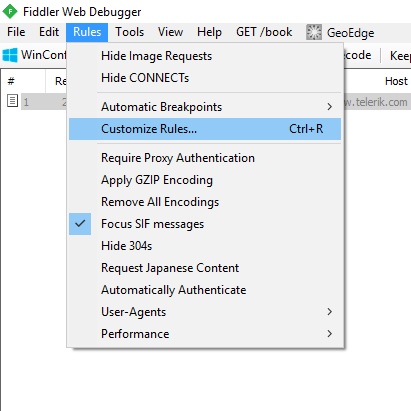
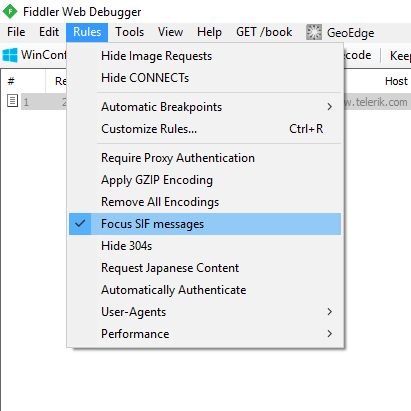

# Fiddler
This folder contains custom rules for the web debugging proxy [Fiddler](http://www.telerik.com/fiddler) to filter out non-SIF3 ([Systems/Schools Interoperability Framework, version 3.x of the Global Infrastructure](http://specification.sifassociation.org/Implementation/Infrastructure/3.2/contents.xhtml)) messages.

To use this script please see  [How do I use `CustomRules.js`?](#how-do-i-use-customrulesjs).

##Frequently Asked Questions

###What is Fiddler?
Created by Telerik, [Fiddler](http://www.telerik.com/fiddler) is a free web debugging proxy. It works by setting up a system proxy, allowing the messages being sent/received between consumer, environment and provider to be monitored.

To learn how to get started with Fiddler please [read their documentation](http://docs.telerik.com/fiddler/configure-fiddler/tasks/configurefiddler). 

###How do I get Fiddler to capture localhost traffic?
This is a known issue, particularly in .NET projects where local addresses will bypass the system proxy. This can be avoided by modifying the system's `HOSTS` file to add fake domains.

This can be done by hand, or with a console command.

In Windows this can be achieved using tools such as [Hosts Commander](http://vegalogic.com/go/hostscmd/). With this tool in your path you can add new host entry for a fake domain, e.g. `sif.demo.domain`, that points at localhost with a console command:
```
hosts.exe add sif.demo.domain
```
Assuming all your fake domains start with the same text wildcards can be used to remove them in the future. For example, the console command to remove all domains that start with `sif.demo.` would be:
```
hosts.exe rm sif.demo.*
```

###How do I use `CustomRules.js`?
Firstly, install the **Syntax-Highlighting Add-On** available from http://www.telerik.com/fiddler/add-ons. This will give you access to the fiddler script editor.

Open Fiddler and open the script editor by selecting *Rules > Customize Rules…* or by pressing *ctrl-R*.



The entire contents of the rules script can be replaced by the contents of `CustomRules.js`. If all has been installed correctly then there should be a new enable/disable option in *Rules > Focus SIF messages*, as seen below:



When this is *enabled* only filtered messages will be displayed. When *disabled* all messages otherwise captured by the proxy will be displayed. 

###What if I have already modified my rules?
There are only two blocks of code in `CustomRules.js` that are needed. These can be found at the following locations, note the comments above and below the necessary code to include:
```javascript
...
class Handlers
{
    ...
	/*
	:: BEGIN SIF RULE OPTION
	*/
    This code sets up the menu interface 
	/*
	:: BEGIN SIF RULE OPTION
	*/
    ...
	static function OnBeforeRequest(oSession: Session) {
		/*
		:: BEGIN SIF RULES
		*/
        This code does the message filtering
		/*
		:: END SIF RULES
		*/
        ...
	}
    ...
}
```

###How do these rules filter non-SIF messages?
Currently the script filters out any message that does not have one of the following header properties:
- messageid
- requestid
- connectionid
- applicationkey
- accesstoken
- authorization (this is not a SIF3 specific header, but required otherwise we miss some basic message)

In the 3.2 SIF specification there is no mandatory header property in all requests, responses and events. This does a best guess to identify SIF messages.

###How do I see incomming messages to my provider/broker/etc.?
By default Fiddler will only be able to show messages initiated from the host machine. To make Fiddler see incomming traffic it needs to be set up as a reverse proxy. That is, point your incomming traffic as Fiddler, which then forwards it to your provider. [Instructions on how to set Fiddler up for reverse proxy can be found on the Telerik website](http://docs.telerik.com/fiddler/Configure-Fiddler/Tasks/UseFiddlerAsReverseProxy)

##Example usage with the SIF3 .NET Framework
These instructions will explain how to set up one of the demo projects included with the [.NET SIF3 Framework](https://github.com/Access4Learning/sif3-framework-dotnet) so that the messages are caught in Fiddler. This assumes that all applications will run on a single machine.
1. Download and install Fiddler
2. Follow the [instructions in the FAQ](#how-do-i-use-customrulesjs) to set up Fiddler with `CustomRules.js`.
3. Run Fiddler and enable SIF3 filtering.
4. Clone the framework to your computer.
5. Load the Sif3FrameworkDemo (`Code/Sif3FrameworkDemo`) into Visual Studio to ensure that it generates the file `Code/Sif3FrameworkDemo/.vs/config/applicationhosts.config`
6. Edit `Code/Sif3FrameworkDemo/.vs/config/applicationhosts.config`, find the `<sites />` element and change the `<binding />` properties the provider you wish to run so that it it binds to `127.0.0.1` rather than `localhost`. You may also wish to add `serverAutoStart="true"` to the `<site />` element. The edited `<site />` element should look something like this:
```xml
<site name="Sif.Framework.Demo.Uk.Provider" id="4" serverAutoStart="true">
	<application path="/" applicationPool="Clr4IntegratedAppPool">
		<virtualDirectory path="/" physicalPath="REPOSITORY_LOCATION\Sif3Framework-dotNet\Code\Sif3FrameworkDemo\Sif.Framework.Demo.Uk.Provider" />
	</application>
	<bindings>
		<binding protocol="http" bindingInformation="*:51424:127.0.0.1" />
	</bindings>
</site>
```
7. Add fake hostnames to your `HOSTS` file as described in the [FAQ](#how-do-i-get-fiddler-to-capture-localhost-traffic). Add the following faked domain name: 
```
hosts.exe add sif.demo.domain
```
8. In the Sif.Framework.Demo.Setup project, edit the `EnvironmentResponse.xml` XML for your chosen demo. in the `<infrastructureServices />` element replace where it references `localhost` with `sif.demo.domain`. It will look something like this:
```xml
...
<infrastructureServices>
	<infrastructureService name="environment">http://sif.demo.domain:62921/api/environments</infrastructureService>
	<infrastructureService name="requestsConnector">http://sif.demo.domain:51424/api</infrastructureService>
	<infrastructureService name="servicesConnector">http://sif.demo.domain:51424/services</infrastructureService>
	...
</infrastructureServices>
...
```
9. In the consumer demo project of your choice, e.g. Sif.Framework.Demo.Uk.Consumer, edit the `SifFramework.config` file setting the `consumer.environment.url` property to point to the faked domain. That is:  
```xml
<add key="consumer.environment.url" value="http://sif.demo.domain:62921/api/environments/environment"/>
```
10. In the provider demo project of your choice, e.g. Sif.Framework.Demo.Uk.Provider, edit the `SifFramework.config` file setting the `provider.environment.url` property to point to the faked domain. That is:  
```xml
<add key="provider.environment.url" value="http://sif.demo.domain:62921/api/environments/environment"/>
```
11. Recompile the demo solution to ensure all changes have been moved to the right places.
12. Go to `REPOSITORY_LOCATION/Sif3Framework-dotNet/Scripts/BAT/Demo execution` and execute the appropriate setup script for your selected demo, for example `DemoUkSetup.bat` for the UK locale project.
13. Run the scripts `EnvironmentProvider.bat` to start the environment, followed by the start provider script for your loacale (e.g. `DemoUkProvider.bat`) and then run the start consumer script for your locale (e.g. `DemoUkConsumer.bat`).
14. Look at Fiddler, you should see all messages between consumer, environment provider, and the service providers.
